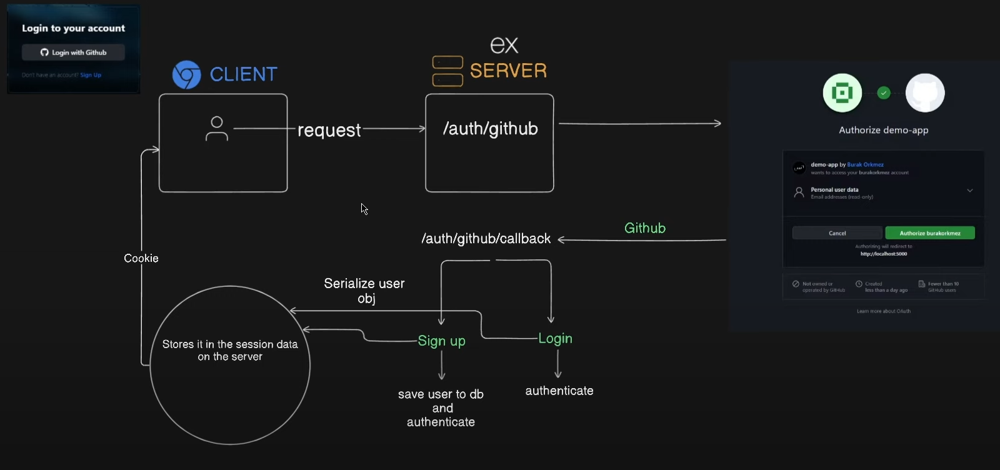

create dirs -> frontend, backend
cd frontend
npm create vite@latest . -> React, JS
npm install
npm run dev
npm install -D tailwindcss postcss autoprefixer
npx tailwindcss init -p
npm install react-router-dom react-hot-toast react-icons

flowbite for ract tables, butns, also timeline(line thing)
tailwind css glass morphism generator - glass effects

https://api.github.com/ - visit to understand github api

https://react-hot-toast.com/ - loader/spinner 

60 requests per hour for unauthenticated users, 5k for authed - https://docs.github.com/en/rest/using-the-rest-api/rate-limits-for-the-rest-api?apiVersion=2022-11-28
gtihub-> dev sett -> personal access tokens -> classic -> gen -> name: GitFolio_ -> scope: repo -> gen 

.env is not a safe opt to store token usr can see through inspect ( inspect -> assets -> js file - search token...)

npm init -y -- in root dir -- PS E:\Learning\React TypeScript\00_GitFolio - Mern Stack Project _ GitHub like app> 
npm i express cors mongoose dotenv -- same in root

move .gitignore file to root from frontend
npm i nodemon --save-dev --> after writing     "dev": "nodemon server.js"   --> "dev": "nodemon backend/server.js" 

npm run dev -- in root as well to start back server

api in files used |-> backend-controller-user.controller.js, HomePG, ExplorePG

deleted .env from frontend cause now i am using server.js in backend to handle API requests

created new project in mongodb, create deployement, create user cpy pass add 0.0.0.0, finish and it's done.
connect, drivers, copy conn str and replace pass that we previously copied, also added github-db befor first ?
To connect create db-connectMongoDB.js-

now its time for auth so visiting passportjs - Passport can be unobtrusively dropped in to any Express-based web application. A comprehensive set of strategies support authentication using a username and password, Facebook, Twitter, and more.
i'm using `Passport-GitHub2`
npm install passport-github2 passport

## auth representation

now we need GITHUB_CLIENT_ID / SECRET so for that register a neew OAuth application in gihub, homepage url given - http://localhost:3000/ , authorization callback url - http://localhost:5000/auth/github/callback register and that gives client id cpy and gen secret from there
npm i express-session
2:59:00 to understand flow fro now

now add onClick={handleLoginWithGithub} in signup as in frontend to execute it

good thing to notich i have forgot to add "api" in my Oauth callback url in github which cause me lots of headachy debugging
http://localhost:5000/api/auth/github/callback

if dont want to write http://localhost:5000 every time -> vite.config.js -> add proxy:{"http://localhost:5000/api":{target: "http://localhost:5000"}}
somehow i got error while i didnt add proxy in vite and i was wordering what could possibly be wrong, but as soon as i add proxy voila i get user data means something....

commit -/M working passport auth
now like functionality

npm install node-fetch - to implement dir down func

after makeing some changes in server.js and npm run build from frontend cd.. it should work by only one npm run dev, 
keep in mind also need to change git OAuth urls which i can do after getting deploy url... 
hosting serever used is render.com > new > web service > deploy from git repo > connect repo,

change build cmnd to - npm run build, & for start - npm run start, put env file key vals
we are adding client base url once we deploy it so we can get url > create web service

and update the OAuth urls to -> https://gitfolio-37ek.onrender.com/
and add CLIENT_BASE_URL=https://gitfolio-37ek.onrender.com/ in render env as well, also update callback url
- gti add .
- git commit -m "callback url & Docs Updted"
- git push

and after that render again deploy it so i have sort err that i can fix and push👍.